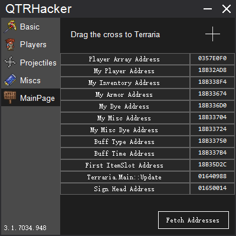

# QTRHacker
## QTRHacker is in place of the old hack: 
**https://github.com/ZQiu233/TR_Hacker**

All releases: https://github.com/ZQiu233/QTRHackerUpdatesHistory/tree/master/Updates

Now QTRHacker is much stronger than the old one.
Sorry for that there's no English version for the newest version.
Maybe you should compile it by yourself.

## Environmental requests
* Windows 7 or above(32/64).
* .Net Framework 4.6.2 or above.
* VC Runtime(VC Redist).

## How to compile:
1. Install Visual Studio 2017
2. Clone or download this repo.
3. Extract all files if you choice to download.
4. Open the Solution named "QTRHacker" by Visual Studio(Version Selector)
5. Ctrl + F5
6. Then you can see the hack ran.

## Screenshots

