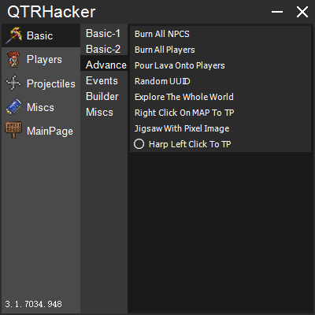
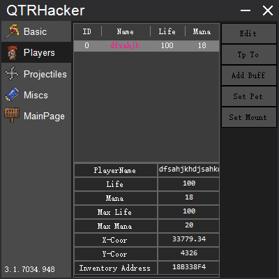
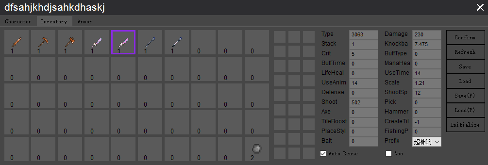
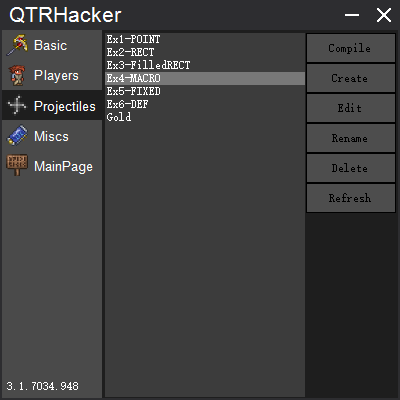
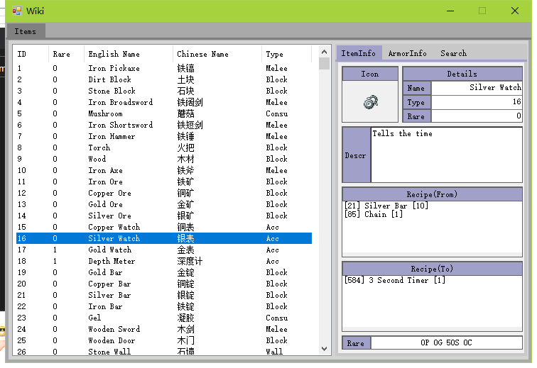

# QTRHacker

**Maybe you have something about this hack to tell,please join this discord server:**  
https://discord.gg/bzKc9vM  
All releases: https://github.com/ZQiu233/QTRHackerUpdatesHistory/tree/master/Updates

## Requirements
* Windows 10 x64
* .NET 5
* VC Runtime(VC Redist).

## How to compile
1. Clone or download this repo.
2. Open the solution named "QTRHacker" by Visual Studio
3. Ctrl + F5

## Screenshots

